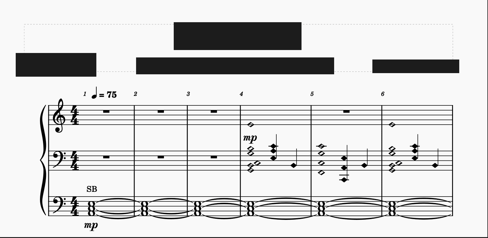
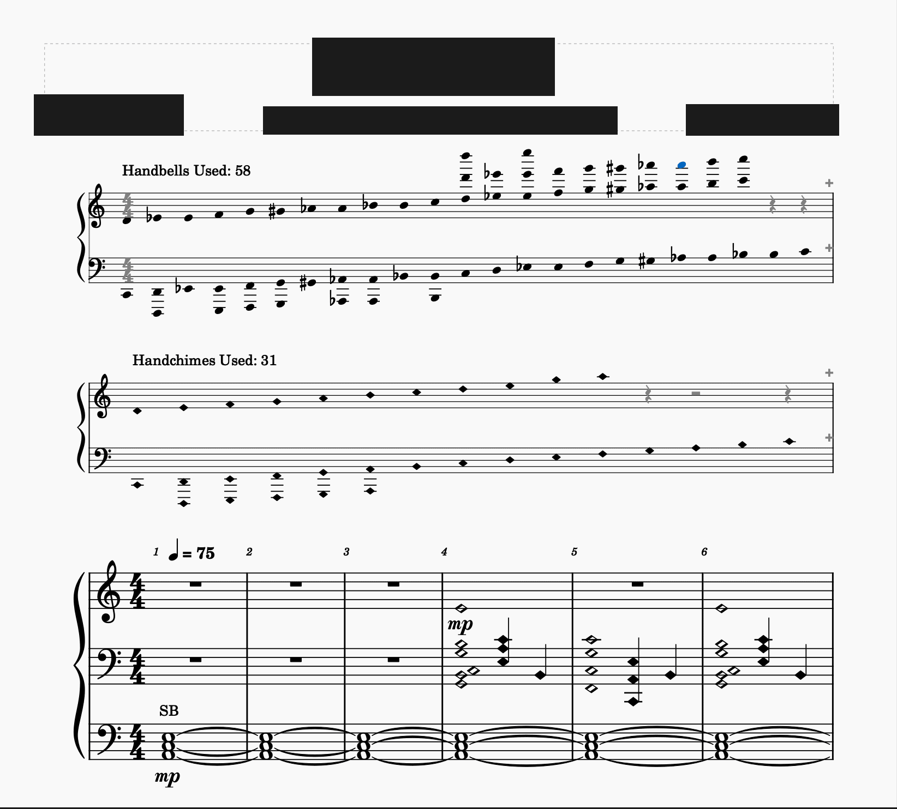

# Handbells Used Chart

Handbell music usually opens with a chart between the title and the first
system: a grand staff showing every bell and chime the piece needs. This
generates that chart for MuseScore 4.7 scores.

Bells appear in pitch order, spelled the way the score spells them. If the score
writes the same bell as both G#5 and Ab5, it appears under both spellings. That
is on purpose. Ringers use the chart to work out position splits, and the
spelling tells the next position over whether it has to share a bell. No natural
sign is ever drawn: a plain E a few columns along from an E flat would otherwise
pick one up and read as a second, separate bell. Handchimes get a chart of their
own, with diamond noteheads, and silver melody bells a third, with square ones.
A score written on a Piano part charts the bells it looks like it has, rather
than the octave below.

Which notehead a note carries is the only thing that decides which chart it
goes on, so all three can be written on one part. MuseScore's palette has no
notehead called "Square": the filled square is the shape-note head **La**, and
that is what silver melody bells are read from and drawn with. A set is C5 to
C7 and nothing else is made, so a square notehead outside that is reported
rather than charted.

## What it looks like

An arrangement as it opens, straight onto the first system:

And the same score after the extension has run, with a chart for the bells and
another for the chimes above the music:

The grey time signature, grey rests and one blue notehead are MuseScore's
editing view showing you what is hidden or out of range. None of them print.

## Two ways to run it

Both front ends load the same planning core, so either one produces the same
chart from the same score. Where they differ is what they need and what they
can do:

| | Command-line tool | MuseScore extension |
|---|---|---|
| Needs MuseScore installed | no, it edits the `.mscz` directly | yes, 4.7 |
| Where you run it | a terminal, a script, CI | inside MuseScore, from the Plugins menu |
| Input | `.mscz` file in, `.mscz` file out | the score you have open |
| Hides the piece's own empty staves | only if you ask (`--hide-empty-staves`) | always; the API offers nothing narrower |
| Removes a chart | `--remove` | re-running replaces it, but there is no remove command |

Neither can replace the other's chart. See [Known limitations](#known-limitations).

## Requirements

Node 22 or newer, with no runtime dependencies. The extension also needs
MuseScore Studio 4.7.

## Command-line tool

    npm run chart -- input.mscz output.mscz

Both paths are required and both are `.mscz` archives. The input is never
modified in place.

| Option | Effect |
|---|---|
| `--bell-label TEXT` | replaces the generated "Handbells Used: *n*" |
| `--chime-label TEXT` | replaces the generated "Handchimes Used: *n*" |
| `--chime-color HEX` | notehead colour for chimes, e.g. `#c00000`. Defaults to the score's own `handchimesColor` property |
| `--smb-label TEXT` | replaces the generated "SMBs Used: *n*" |
| `--smb-color HEX` | notehead colour for silver melody bells. Defaults to the score's own `handbellChartSmbColor` property |
| `--smbs-optional` | adds "(optional)" to the silver melody bell label |
| `--hide-empty-staves` | also let the piece's own staves hide, so they do not sit blank beneath the chart |
| `--remove` | strip an existing chart instead of generating one |
| `--required-bell-first NAME` | first bell that is not optional, e.g. `C5` |
| `--required-bell-last NAME` | last bell that is not optional, e.g. `C8` |
| `--required-chime-first NAME` | first chime that is not optional |
| `--required-chime-last NAME` | last chime that is not optional |

Run it on a score that already has one of its charts and it replaces that chart
rather than adding a second, so you can regenerate after the music changes.
`--remove` also puts back the hide-empty-staves setting the score had before the
chart went in.

It prints the labels it drew. Anything left off the chart gets a warning: notes
with an unreadable pitch or spelling, notes whose notehead it did not recognise,
bells outside C2-C9, and silver melody bells outside C5-C7.

## MuseScore extension

Requires MuseScore Studio 4.7.

Copy the `handbells-used-chart` folder into MuseScore's extensions directory:

| Platform | Directory |
|---|---|
| macOS | `~/Library/Application Support/MuseScore/MuseScore4/extensions/` |
| Linux | `~/.local/share/MuseScore/MuseScore4/extensions/` |
| Windows | `%LOCALAPPDATA%\MuseScore\MuseScore4\extensions\` |

This is not the same place as the older Plugins folder.

Restart MuseScore, open a score, and choose Handbells Used Chart from the
Plugins menu. Running it again replaces the chart it made last time, without
asking for confirmation.

It refuses to touch a chart it cannot recognise as its own, and tells you why
instead. That covers adding, removing or moving instruments after a run,
inserting a measure ahead of the chart, and editing any of the fields below that
it uses to identify its work. The remedy is always the same: delete the chart by
hand in MuseScore, then run it again.

### Settings

Set these in Project Properties, as custom fields:

| Field | Effect |
|---|---|
| `handbellChartBellLabel` | replaces the generated "Handbells Used: *n*" |
| `handbellChartChimeLabel` | replaces the generated "Handchimes Used: *n*" |
| `handchimesColor` | notehead colour for chimes, e.g. `#c00000` |
| `handbellChartSmbLabel` | replaces the generated "SMBs Used: *n*" |
| `handbellChartSmbColor` | notehead colour for silver melody bells |
| `handbellChartSmbsOptional` | set to `yes` to add "(optional)" to the SMB label |
| `handbellChartQuiet` | set to `yes` to report to the log instead of showing dialogs |
| `handbellChartRequiredBellFirst` | first bell that is not optional, e.g. `C5` |
| `handbellChartRequiredBellLast` | last bell that is not optional, e.g. `C8` |
| `handbellChartRequiredChimeFirst` | first chime that is not optional |
| `handbellChartRequiredChimeLast` | last chime that is not optional |

Bells outside the required range are bracketed and labelled *optional*, the way
published charts mark them. Leave an end unset for no limit there; leave all
four fields unset and the chart draws no bracket at all.

Silver melody bells have no range fields of their own. A set is usually
optional as a whole rather than bell by bell, so `handbellChartSmbsOptional`
marks the label — "SMBs Used: 8 (optional)" — instead of bracketing columns.
A label you write yourself replaces the whole of the generated one, marker
included.

Set `handbellChartQuiet` on any score you process with `mscore -j`. A dialog in
a batch run has nobody to dismiss it and blocks until the process is killed.
Worse, MuseScore saves at the end of a job, so the output file never gets
written at all.

The plugin writes fields of its own back to Project Properties. You do not need
to set or keep them, but you will see them:

| Field | Meaning |
|---|---|
| `handbellChartReport` | what the last run drew, or that it removed a chart |
| `handbellChartError` | why the last run refused; empty when it succeeded |
| `handbellChartParts`, `handbellChartTotal`, `handbellChartColumns` | how the plugin recognises its own chart so it can replace it. Edit these and the chart becomes unidentifiable, so the plugin will refuse to touch it |
| `handbellChartStyle_*` | the style settings the chart changed, so removing it can put them back |

With `handbellChartQuiet` set it also writes `handbellChartRan` and
`handbellChartFound`, which record what the run read. Those two exist so the
automated tests can observe a headless run.

## Known limitations

Extension only:

- Adding a chart turns on the score-wide hide empty staves style. It is the only
  mechanism the plugin API offers for keeping the handchime staves from sitting
  blank under the handbell chart, because `hideWhenEmpty` is not a property a
  plugin can set on a staff. One consequence reaches the rest of your music while
  the chart is there: any staff that rests for a whole system now hides there
  too. Removing the chart puts the setting back to whatever it was before.
- The chart's instrument name appears at the left of the chart system.
  `part.longName` and `part.partName` are read-only from a plugin.
- Bells above C7 keep MuseScore's out-of-range colour on the chart staves. The
  command-line tool sets the instrument's usable range to C2-C9 so this does not
  happen; a plugin cannot, because `minPitchA`, `maxPitchA`, `minPitchP` and
  `maxPitchP` are not properties the API puts on a Part.
- The chart staves keep their ordinary barlines, and their time signature is
  hidden rather than switched off. "Show barlines" and "Show time signature" are
  StaffType settings, and the API hands out no StaffType. The printed result
  matches either way, but the settings in Staff/Part properties do not.

Command-line tool only:

- A single optional bell at the very first column of a chart prints the italic
  word "optional" with no bracket over it. A run one column wide spans no time,
  and the tool draws its bracket by offsetting a line MuseScore has already laid
  out — at the first column of a measure MuseScore lays out none, so there is
  nothing to offset. At any later column the bracket is drawn, and the extension
  draws it wherever the bell falls. The word marks the bell optional either way.

Both:

- Which octave a score is charted at comes from the part's own transposition.
  A bell's name is its written pitch plus an octave, and MuseScore stores the
  sounding pitch, so the correction is an octave less whatever the part already
  transposes. Handbells and handchimes transpose up an octave, so nothing is
  added to them. A Piano part does not transpose, so it gets the octave. A part
  you transposed up an octave yourself reads correctly too, and so does one
  carrying some other instrument entirely.

- Ottavas are read as well. A bell under an 8va line is charted an octave above
  where it is drawn, because that is the bell the ringer picks up. The same
  goes for 8vb, 15ma, 15mb, 22ma and 22mb. MuseScore keeps the line out of the
  note's own pitch, so each front end works it out separately: the extension
  asks the staff, the command-line tool reads the spanner out of the XML. A
  line entered in one voice moves the notes of every other voice under it, the
  way MuseScore plays it.
- The plugin and the command-line tool cannot replace each other's charts. Each
  identifies its own work in a way the other can neither write nor read: the
  tool names its parts, which a plugin cannot do, and the plugin records counts
  the tool never looks for. On a score carrying a chart the tool made, the
  plugin refuses to run, so strip it first with
  `npm run chart -- in.mscz out.mscz --remove`. The tool does not recognise a
  chart the plugin made and will add a second one beside it, so delete the
  plugin's chart in MuseScore before running it.

## Layout

    handbells-used-chart/lib/    planning core: note records in, chart plan out
    handbells-used-chart/        the MuseScore extension
    tools/                       the command-line tool
    test/unit/                   pure JavaScript, runs anywhere
    test/e2e/                    the command-line tool, end to end
    test/extension/              drives a real MuseScore headlessly
    test/fixtures/               synthetic .mscx scores authored for this project

`lib/` is the shared contract. Both front ends load it, so a change there lands
in both, and the two should produce the same chart from the same score.

## Testing

    npm test

| Command | Runs |
|---|---|
| `npm test` | everything |
| `npm run test:fast` | unit and end-to-end tests, no MuseScore needed |
| `npm run test:extension` | the tests that drive a real MuseScore |

The extension tests copy the extension into your MuseScore 4.7 data directory
and enable it there before running. Your own plugin registrations survive, but
the extension itself stays installed afterwards.

They skip if MuseScore is not on the path. If it is on the path but broken, they
fail rather than skip, because a silent skip once took the whole extension suite
out of a run that still reported green.

They also run one file at a time. Several MuseScore instances at once under
`xvfb` intermittently abort before writing their output.

GitHub Actions runs both halves on every pull request into `main`, installing the
same MuseScore version this targets so the extension tests really run rather than
skipping.

## License

GPL-3.0-only. The note-reading logic is adapted from the
[handbell-notation](https://github.com/andy-lyttle/handbell-notation) plugins,
copyright 2025 Andy Lyttle, used under the GPL-3.0.
